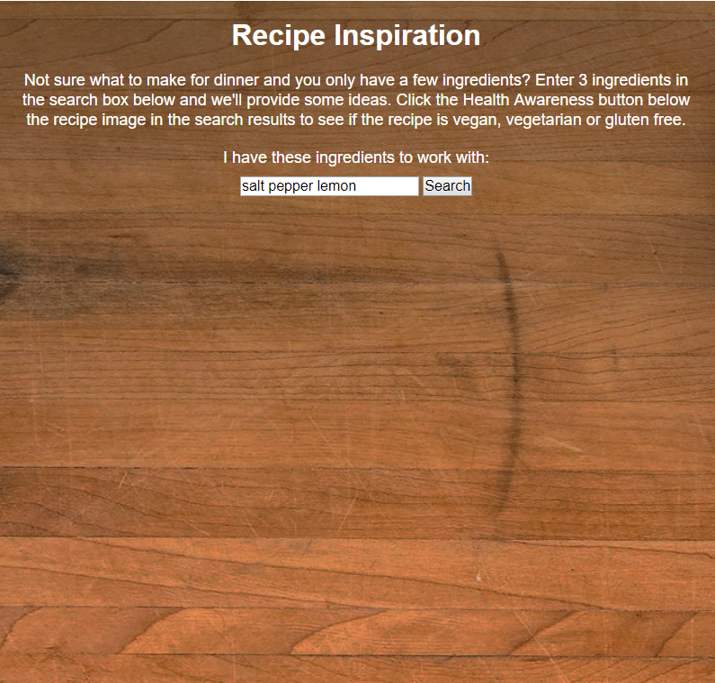
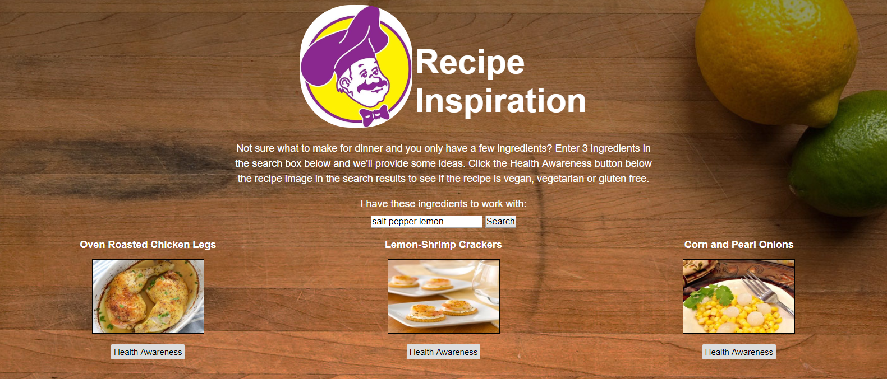
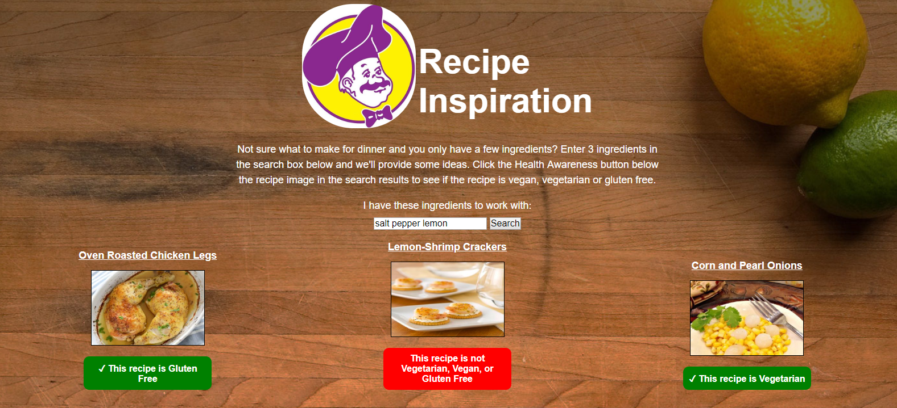

# Recipe Inspiration
This app serves to provide some recipe inspiration using the Spoonacular API. The premise is simple, just add 3 ingredients either you have on hand or that you would like to cook with and the app will return some recipe ideas with links to the recipes and photos of each. For those users who practice a vegan, vegetarian or gluten free diet I've included a button below the recipe image for users to instantly check if the recipe they are seeing is vegan, vegetarian, all of the above or none of the above instead of having to look through the recipe details on the Spoonauclar site.

## Demo
[Live Demo](https://anthonypagano.github.io/recipe-inspiration/)

## Screenshots
Landing Page

Search Results

Nutrition Awareness Results

## Built With
HTML, CSS, JavaScript, jQuery
